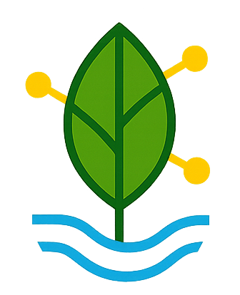

# 🌱 VertiGrow - Agricultura Vertical Urbana

<div align="center">
  
  
  **Conectando produtores urbanos através de tecnologia LoRa e sustentabilidade**
  
  [](https://developer.mozilla.org/en-US/docs/Web/HTML)
  [](https://developer.mozilla.org/en-US/docs/Web/CSS)
  [](https://developer.mozilla.org/en-US/docs/Web/JavaScript)
  [](https://getbootstrap.com/)
  [](https://leafletjs.com/)
</div>

## 📖 Sobre o Projeto

O **VertiGrow** é uma plataforma inovadora que conecta produtores de agricultura vertical urbana através de uma rede de sensores IoT com tecnologia LoRa. O projeto promove a sustentabilidade urbana, facilitando trocas, vendas e doações de produtos orgânicos cultivados em sistemas hidropônicos verticais.

### 🎯 Objetivos
- **Conectar** produtores urbanos de agricultura vertical
- **Facilitar** trocas e vendas de produtos orgânicos
- **Promover** sustentabilidade e redução do desperdício
- **Integrar** tecnologia IoT (LoRa/ESP32) ao cultivo urbano
- **Fortalecer** comunidades locais através da agricultura

### 🏆 Vitrine Inova CPS 2024
Este projeto foi desenvolvido para a **Vitrine Inova CPS**, demonstrando a integração entre agricultura urbana, tecnologia IoT e sustentabilidade.

## 🚀 Tecnologias Utilizadas

### Frontend
- **HTML5** - Estrutura semântica
- **CSS3** - Estilização moderna com variáveis CSS
- **JavaScript ES6+** - Interatividade e funcionalidades
- **Bootstrap 5.3** - Framework CSS responsivo
- **Font Awesome 6** - Ícones vetoriais
- **Leaflet** - Mapas interativos

### Design & UX
- **Paleta Verde Sustentável** - Identidade visual ecológica
- **Responsivo** - Mobile-first design
- **Acessibilidade** - ARIA labels e navegação por teclado
- **Micro-interações** - Animações suaves e feedback visual

### Simulação IoT
- **Rede LoRa simulada** - Conectividade de longa distância
- **Sensores ESP32** - Monitoramento de pH, TDS e temperatura
- **Dados em tempo real** - Status dos sistemas hidropônicos

## 📁 Estrutura do Projeto

```
agriculturaVertical/
├── 📂 assets/
│   ├── 📂 css/
│   │   └── style.css           # Estilos customizados
│   ├── 📂 js/
│   │   └── main.js            # JavaScript principal
│   └── 📂 images/
│       ├── VertGrowLogo.png   # Logo do projeto
│       └── 📂 exemplos/       # Imagens dos produtos
├── 📄 index.html              # Página principal
├── 📄 README.md               # Documentação
└── 📄 package.json            # Dependências (futuro)
```

## 🌟 Funcionalidades

### 🗺️ Mapa Interativo com Leaflet
- **Geolocalização real** de produtores em São Paulo
- **Marcadores customizados** por tipo (Disponível, Venda, Doação)
- **Popups informativos** com dados dos produtores
- **Simulação LoRa** - Status de conectividade em tempo real
- **Filtros dinâmicos** por produto e tipo de transação

### 👥 Perfis de Produtores
- **6 produtores únicos** com avatars e localizações reais
- **Produtos variados**: Alface, Manjericão, Tomates, Rúcula, Espinafre, Cebolinha
- **Sistemas de avaliação** com estrelas e histórico de trocas
- **Tipos de transação**: Troca, Venda, Doação

### 🤝 Sistema de Interações
- **Modais interativos** para trocas, compras e perfis
- **Feedback visual** com toasts e animações
- **Simulação de conectividade** LoRa em tempo real
- **Interface estilo Airbnb** para filtros e cards

### 📱 Responsividade Completa
- **Mobile-first** design otimizado
- **Breakpoints Bootstrap** para todas as telas
- **Touch-friendly** - Gestos e interações móveis
- **Performance otimizada** com lazy loading

### Uso da Aplicação
1. **Explore o mapa** - Clique nos marcadores para ver produtores
2. **Filtre produtos** - Use os filtros para encontrar itens específicos
3. **Interaja com cards** - Clique em Trocar, Comprar ou Ver Perfil
4. **Teste a responsividade** - Redimensione a janela ou use mobile

## 🎨 Identidade Visual

### Paleta de Cores
```css
:root {
  --verde-musgo: #2E7D32;      /* Cor principal */
  --verde-claro: #4CAF50;      /* Accent */
  --amarelo-suave: #FFC107;    /* Warnings/Vendas */
  --branco: #FFFFFF;           /* Backgrounds */
  --cinza-claro: #F5F5F5;      /* Cards */
  --cinza-medio: #9E9E9E;      /* Textos secundários */
  --cinza-escuro: #424242;     /* Textos principais */
}
```

### Tipografia
- **Primary**: Inter (Headings) - Moderna e limpa
- **Secondary**: 'Segoe UI' (Body) - Legível e universal

### Componentes
- **Cards estilo Airbnb** - Design familiar e intuitivo
- **Botões com micro-interações** - Feedback visual imediato
- **Badges coloridos** - Identificação rápida de status
- **Avatars circulares** - Identidade pessoal dos produtores

## 🌐 Demonstração

### Produtores Disponíveis
| Nome | Produto | Tipo | Localização | Rating |
|------|---------|------|-------------|---------|
| João Silva | Alface Crespa | Troca | Pinheiros, SP | ⭐⭐⭐⭐⭐ |
| Maria Santos | Manjericão | Venda (R$ 5,00) | Vila Madalena, SP | ⭐⭐⭐⭐ |
| Carlos Oliveira | Tomates Cereja | Troca | Perdizes, SP | ⭐⭐⭐⭐⭐ |
| Ana Costa | Rúcula Orgânica | Troca | Consolação, SP | ⭐⭐⭐⭐ |
| Pedro Lima | Espinafre Baby | Venda (R$ 4,50) | Bela Vista, SP | ⭐⭐⭐⭐⭐ |
| Lúcia Ferreira | Cebolinha Verde | Doação | Liberdade, SP | ⭐⭐⭐⭐⭐ |

### Tecnologia Simulada
- **Rede LoRa** - Conectividade de longa distância
- **Sensores ESP32** - Monitoramento em tempo real
- **Sistema hidropônico NFT** - Técnica de filme nutritivo
- **Controle automatizado** - pH, TDS, temperatura

## 🛠️ Desenvolvimento Futuro

### Próximas Funcionalidades
- [ ] **Backend PHP/MySQL** - Persistência de dados
- [ ] **Sistema de autenticação** - Login de produtores
- [ ] **Chat em tempo real** - Comunicação entre usuários
- [ ] **Sistema de pagamento** - Integração com PIX/cartões
- [ ] **App mobile nativo** - React Native ou Flutter
- [ ] **Hardware LoRa real** - Integração com ESP32
- [ ] **Dashboard IoT** - Monitoramento em tempo real
- [ ] **Sistema de entregas** - Logística local

### Melhorias Técnicas
- [ ] **PWA (Progressive Web App)** - Funcionalidade offline
- [ ] **TypeScript** - Tipagem estática
- [ ] **Webpack/Vite** - Build otimizado
- [ ] **Testes automatizados** - Jest/Cypress
- [ ] **CI/CD** - Deploy automatizado
- [ ] **Docker** - Containerização

## 👨‍💻 Contribuição

### Como Contribuir
1. **Fork** o projeto
2. **Crie** uma branch para sua feature (`git checkout -b feature/AmazingFeature`)
3. **Commit** suas mudanças (`git commit -m 'Add some AmazingFeature'`)
4. **Push** para a branch (`git push origin feature/AmazingFeature`)
5. **Abra** um Pull Request

### Padrões de Código
- **Indentação**: 4 espaços
- **Nomenclatura**: camelCase para JS, kebab-case para CSS
- **Comentários**: JSDoc para funções
- **Commits**: Conventional Commits

## 📄 Licença

Este projeto está licenciado sob a **MIT License** - veja o arquivo [LICENSE](LICENSE) para detalhes.

## 📞 Contato

**Equipe VertiGrow**
- 🌐 Website: [seu-site.com](https://seu-site.com)
- 📧 Email: contato@vertigrow.com
- 💼 LinkedIn: [linkedin.com/company/vertigrow](https://linkedin.com/company/vertigrow)

---

<div align="center">
  <h3>🌱 Cultivando o futuro das cidades com tecnologia e sustentabilidade</h3>
  
  **Feito com ❤️ para a Vitrine Inova CPS 2024**
</div>